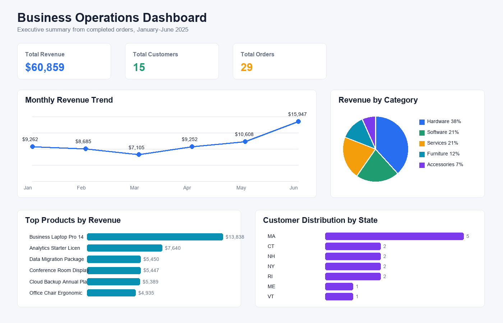
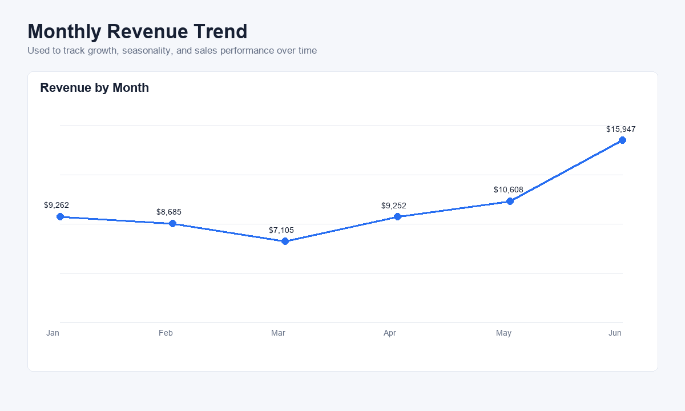
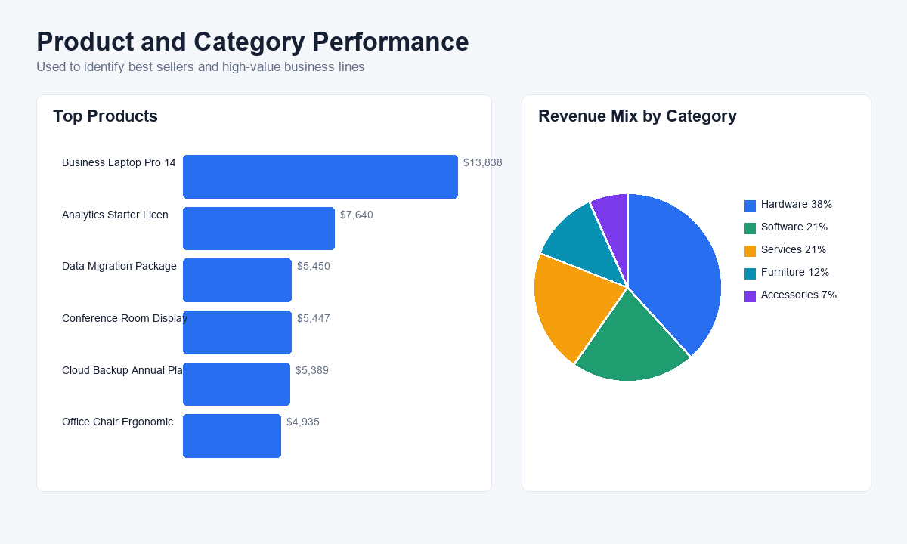

# Business Operations Dashboard

## Project Overview

The **Business Operations Dashboard** is a beginner-friendly analytics portfolio project that shows how business data can be organized, queried, and turned into dashboard insights.

The project uses a realistic sample business that sells hardware, software, furniture, accessories, and services to small and mid-sized organizations. It demonstrates SQL table design, sample data loading, KPI analysis, Power BI dashboard planning, and business insight communication.

This project is suitable for entry-level **Data Analyst**, **Business Analyst**, and **Data Conversion Engineer** roles because it shows both technical work and business explanation.

## Folder Structure

```text
business-operations-dashboard
|
├── README.md
├── sql
│   ├── create_tables.sql
│   ├── insert_sample_data.sql
│   └── analysis_queries.sql
├── dashboard
│   ├── dashboard_layout.md
│   └── dashboard_screenshots
│       ├── dashboard_overview.png
│       ├── monthly_revenue_trend.png
│       └── product_category_performance.png
└── data
    └── sample_dataset.csv
```

## Dataset Structure

The project includes four business entities.

| Table | What It Represents | Example Fields |
|---|---|---|
| `customers` | Companies that purchased from the business | `customer_id`, `customer_name`, `segment`, `city`, `state`, `signup_date` |
| `products` | Items and services sold by the business | `product_id`, `product_name`, `category`, `unit_price` |
| `orders` | One row per customer order | `order_id`, `customer_id`, `order_date`, `order_status`, `sales_channel` |
| `transactions` | Individual product lines inside each order | `transaction_id`, `order_id`, `product_id`, `quantity`, `discount_amount`, `line_total` |

The CSV file is a flattened version of the same data. It is useful for Power BI because all customer, product, order, and transaction fields are already joined into one file.

## SQL Analysis Process

1. `create_tables.sql` creates the relational database tables.
2. `insert_sample_data.sql` loads realistic sample records.
3. `analysis_queries.sql` answers business questions using joins, grouping, aggregation, date logic, and window functions.

## SQL Query Explanations

### 1. Total Revenue, Orders, and Customers

This query adds all `line_total` values from completed orders. It also counts unique orders and customers. It answers: **How is the business performing overall?**

### 2. Revenue by Month

This query groups order revenue by month. It answers: **Is revenue growing or declining over time?**

### 3. Revenue by Product Category

This query joins transactions to products and groups sales by category. It answers: **Which business lines generate the most revenue?**

### 4. Top Customers by Spending

This query groups revenue by customer and calculates average order value. It answers: **Which customers are the most valuable accounts?**

### 5. Top Products by Sales

This query ranks products by revenue and units sold. It answers: **Which products should the business promote, stock, or monitor closely?**

### 6. Customer Growth Trends

This query groups customers by signup month and calculates a cumulative customer count. It answers: **How quickly is the customer base growing?**

### 7. Customer Distribution by State

This query counts customers by state. It answers: **Where are customers located?**

### 8. Month-over-Month Revenue Change

This query compares each month to the previous month using `LAG()`. It answers: **How much did revenue improve or decline compared with last month?**

## Dashboard Design

The dashboard is designed as an executive overview page.



### Total Revenue KPI

**Why chosen:** Revenue is the clearest top-level performance metric.

**Business question:** How much money did completed orders generate?

### Total Customers KPI

**Why chosen:** Customer count shows market reach and customer base size.

**Business question:** How many customers does the company serve?

### Total Orders KPI

**Why chosen:** Order count helps explain whether revenue is driven by many orders or a few large purchases.

**Business question:** How much completed order activity occurred?

### Monthly Revenue Trend Chart

**Why chosen:** A line chart clearly shows revenue movement over time.

**Business question:** Which months were strongest or weakest?



### Top Products Bar Chart

**Why chosen:** A horizontal bar chart makes it easy to compare long product names.

**Business question:** Which products produce the most revenue?

### Revenue by Category Pie Chart

**Why chosen:** A pie chart works well here because there are only five categories.

**Business question:** What percentage of revenue comes from each product category?



### Customer Distribution Visual

**Why chosen:** A location-based distribution visual helps identify geographic concentration.

**Business question:** Which states have the most customers?

## Key Business Insights

- Total revenue from completed orders is **$60,859**.
- The business has **15 customers** and **29 completed orders**.
- **June 2025** is the strongest month, with **$15,947** in revenue.
- **Hardware** is the highest revenue category, generating **$23,282**, or about **38%** of total revenue.
- The top product is **Business Laptop Pro 14**, generating **$13,838**.
- Top customers include **Northstar Medical Group**, **Beacon Engineering**, and **Greenfield Academy**.
- Revenue dipped in March but recovered in April and grew strongly in May and June.

## Skills Demonstrated

- SQL table creation and relational database design
- Primary keys, foreign keys, constraints, and indexes
- SQL joins across customers, orders, products, and transactions
- Aggregations using `SUM`, `COUNT`, `GROUP BY`, and `ORDER BY`
- Date-based analysis using monthly grouping
- Window functions using `LAG()` and running totals
- Power BI dashboard planning
- KPI reporting and business insight writing
- Data conversion thinking using both normalized SQL tables and a flattened CSV dataset

## Interview Preparation

### How to Describe This Project to Recruiters

You can say:

> I built a Business Operations Dashboard project using a realistic sales dataset with customers, products, orders, and transactions. I created SQL scripts to build the database, load sample data, and analyze revenue, customer growth, top products, and category performance. I also designed a Power BI-style dashboard with KPIs and visuals that answer common business questions.

For a Data Analyst role, emphasize SQL analysis, dashboard design, and insights.

For a Business Analyst role, emphasize business questions, KPI tracking, and explaining results to stakeholders.

For a Data Conversion Engineer role, emphasize the normalized SQL structure, the flattened CSV output, and the ability to prepare data for reporting tools.

### Common Interview Questions and Answers

**Question:** Why did you separate orders and transactions?

**Answer:** An order can contain multiple products, so the order table stores the order header and the transactions table stores each product line. This avoids repeating order-level information and makes revenue analysis more accurate.

**Question:** Why did you filter to completed orders?

**Answer:** Pending or cancelled orders should not be counted as earned revenue. Filtering to completed orders keeps the revenue KPI accurate.

**Question:** What was the most important insight?

**Answer:** June was the strongest revenue month, and hardware was the largest category. This suggests the business may be growing because of higher-value hardware purchases.

**Question:** What would you improve with more time?

**Answer:** I would add profit margin, sales rep performance, returns, customer lifetime value, and a date table for stronger Power BI time intelligence.

**Question:** How would you validate this data?

**Answer:** I would check for duplicate primary keys, missing foreign keys, negative quantities, orders without transactions, transactions without matching products, and order dates that occur before customer signup dates.

## How to Use This Project

1. Run `sql/create_tables.sql` in a SQL database.
2. Run `sql/insert_sample_data.sql` to load the sample data.
3. Run `sql/analysis_queries.sql` to answer business questions.
4. Import `data/sample_dataset.csv` into Power BI.
5. Build the visuals described in `dashboard/dashboard_layout.md`.

